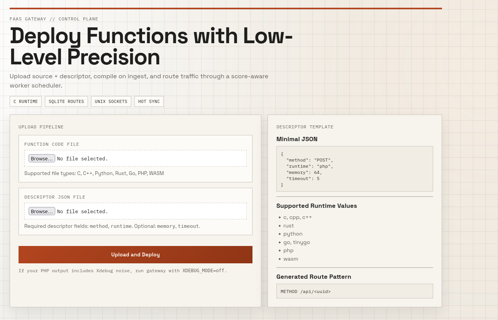

# FaaS

[](#faas)
[](https://github.com/Tednoob17/FaaS)
[](https://github.com/Tednoob17/FaaS)
[](https://github.com/Tednoob17/FaaS/commits/master)
[](https://github.com/Tednoob17/FaaS/stargazers)
[](https://github.com/Tednoob17/FaaS/network/members)
[](https://github.com/Tednoob17/FaaS/issues)
[](#requirements)




A lightweight Function-as-a-Service platform written in C, built around:
- A multi-threaded HTTP gateway
- A worker pool communicating through Unix domain sockets
- Dynamic route configuration stored in SQLite and synchronized in memory
- Metrics-driven scheduling (CPU, memory, I/O score)

## Table of Contents

- [Why This Project](#why-this-project)
- [Core Features](#core-features)
- [Architecture](#architecture)
- [Repository Layout](#repository-layout)
- [Requirements](#requirements)
- [Quick Start](#quick-start)
- [Build and Run](#build-and-run)
- [Runtime Matrix](#runtime-matrix)
- [API and Routes](#api-and-routes)
- [Dynamic Function Upload](#dynamic-function-upload)
- [Benchmarking](#benchmarking)
- [Troubleshooting](#troubleshooting)
- [Authors](#authors)
- [Roadmap](#roadmap)
- [License](#license)

## Why This Project

This repository explores a practical low-level FaaS runtime with a focus on:
- High control over performance-critical paths in C
- Simple deployment model on Linux environments
- Fast local routing using in-memory lookup
- Runtime flexibility (WASM and PHP execution paths)

## Core Features

- Smart worker selection using a score model:

```text
score = 0.5 * cpu + 0.3 * mem + 0.2 * io
```

- Zero-copy style client handoff to workers via FD passing (`SCM_RIGHTS`)
- Dynamic route updates from SQLite to in-memory KV without gateway restart
- Background metrics ingestion from workers every 500 ms
- Upload endpoint to compile/register functions from descriptor + source

## Architecture

High-level request flow:

```text
Client HTTP request
  -> Gateway (HTTP parse + route lookup + scheduler)
  -> Selected Worker (Unix socket)
  -> Runtime execution (PHP, WASM, or native binary)
  -> Direct response to client
```

Background subsystems:
- `kv_sqlite_sync`: periodic synchronization from `faas_meta.db` into RAM
- `metrics_collector`: receives worker metrics via datagram socket

Detailed architecture documentation:
- `ARCHITECTURE.md`

## Repository Layout

```text
.
├── src/
│   ├── gateway.c              # HTTP gateway + scheduler + upload handling
│   ├── worker.c               # Worker runtime execution
│   ├── fd_passing.c/.h        # sendfd/recvfd over Unix sockets
│   ├── http_handler.c/.h      # HTTP parsing, responses, multipart parsing
│   ├── kv.c/.h                # In-memory key-value store
│   ├── kv_sqlite_sync.c       # SQLite -> KV synchronization thread
│   ├── metrics_*.c/.h         # Metrics collection and smoothing
│   └── faas_compiler.c/.h     # Upload compiler pipeline
├── pages/
│   └── upload.html            # Upload UI served at GET /upload
├── examples/
│   ├── hello.c
│   └── descriptor.json
├── benchmarks/
│   ├── run_benchmark.sh
│   ├── quick_test.sh
│   └── analyze_results.py
├── init.sql                   # Initial route data
├── Makefile                   # Canonical build and run targets
├── start.sh                   # Scripted build + run helper
└── stop.sh                    # Stop workers/gateway and cleanup sockets
```

## Requirements

- Linux (native, WSL, container)
- GCC toolchain (`build-essential`)
- `make`
- SQLite runtime and headers (`sqlite3`, `libsqlite3-dev`)
- Runtime/toolchain requirements for executing uploaded functions:
  - `php` CLI for PHP routes
  - `gcc` for C uploads (native binary build)
  - `g++` for C++ uploads (native binary build)
- Optional:
  - `wasmer` for WASM execution in workers

Install base dependencies on Ubuntu/Debian:

```bash
sudo apt-get update
sudo apt-get install -y build-essential make sqlite3 libsqlite3-dev
```

Also recommended for upload workflows:

```bash
sudo apt-get install -y php-cli
```

## Quick Start

```bash
# 1) Build binaries
make

# 2) Initialize SQLite route table
make init

# 3) Start workers + gateway
make start
```

Gateway listens on `http://localhost:8080`.

Web UI is available at:
- `http://localhost:8080/`
- `http://localhost:8080/upload`

Stop everything:

```bash
make stop
```

## Build and Run

### Recommended Path (Makefile)

```bash
make clean
make
make start
```

### Script Path

```bash
chmod +x start.sh stop.sh clean.sh
./start.sh
```

### Build Targets

```bash
make            # build binaries in build/
make init       # create and seed faas_meta.db
make start      # build + init + launch workers and gateway
make stop       # stop worker/gateway processes and cleanup sockets
make clean      # remove build artifacts and runtime files
```

## Runtime Matrix

| Descriptor Runtime | Build Output | Worker Execution Path | Required Tools |
|---|---|---|---|
| `php` | source file | `php <file>` | `php` |
| `wasm` | `.wasm` module | `wasmer run <module>` | `wasmer` |
| `c` | native binary (`module.bin`) | direct `exec` | `gcc` |
| `cpp` / `c++` | native binary (`module.bin`) | direct `exec` | `g++` |
| `rust`, `go`, `tinygo`, `python` | toolchain-dependent | currently mapped to wasm flow | corresponding toolchain |

## API and Routes

### Built-in Seed Routes

From `init.sql`:
- `POST /resize` (PHP demo)
- `GET /ping` (PHP demo)
- `POST /api/hello` (PHP demo)
- `GET /api/info` (PHP demo)
- `GET /python` (WASM example, requires `wasmer` and module)

### Example Calls

```bash
curl -X POST http://localhost:8080/api/hello \
  -H "Content-Type: application/json" \
  -d '{"name":"Alice"}'

curl http://localhost:8080/api/info
```

### Route Data Model

`functions` table schema (`k`, `v`, `updated`):
- `k`: route key in the format `METHOD:/path`
- `v`: JSON descriptor (`runtime`, `module`, `handler`, etc.)
- `updated`: Unix timestamp used by sync thread

## Dynamic Function Upload

Upload endpoint:
- `GET /` and `GET /upload` serve the HTML upload page
- `POST /upload` expects multipart form-data with:
  - field `code`
  - field `descriptor`

Compilation path:
- temporary input directory: `/tmp/progfile`
- output path:
  - `/opt/functions/<uuid>/module.bin` for `c`/`cpp`
  - `/opt/functions/<uuid>/module.wasm` for wasm pipeline

The compiler component (`src/faas_compiler.c`) updates deployment metadata and inserts route config into `faas_meta.db` when available.

Example upload test with repository files:

1. In the UI, upload:
- `examples/hello.c`
- `examples/descriptor.json`
2. After success, call returned route like:

```bash
curl -X POST http://localhost:8080/api/<generated-id> -d '{"name":"Alice"}'
```

## Benchmarking

Quick benchmark:

```bash
cd benchmarks
chmod +x *.sh
./quick_test.sh
```

Full benchmark workflow:

```bash
cd benchmarks
./run_benchmark.sh
python3 analyze_results.py
```

More details:
- `benchmarks/BENCHMARKING_GUIDE.md`
- `PERFORMANCE.md`

## Troubleshooting

### Compilation Fails in `start.sh`

Two common linker/build issues fixed in this repository:

1. Missing object files in script build commands
- Worker must link `fd_passing.o` and `http_handler.o`
- Gateway must link `fd_passing.o`

2. `WEXITSTATUS` unresolved in compiler unit
- `src/faas_compiler.c` needs `#include <sys/wait.h>`

If you still get build errors, use:

```bash
make clean
make
```

Then verify dependencies:

```bash
gcc --version
sqlite3 --version
ls /usr/include/sqlite3.h
```

### Port Already in Use

```bash
sudo lsof -ti:8080 | xargs -r kill -9
make stop
```

### `make start` exits with code `2`

This usually means startup failed early (port conflict, missing dependency, or stale state).

Use this clean recovery sequence:

```bash
make stop
make clean
make
make init
XDEBUG_MODE=off make start
```

### Runtime Execution Errors (`exit_code:127` or missing module file)

If you see errors like:
- `execlp wasmer: No such file or directory`
- `Could not open input file: /opt/functions/...`

Recover with a full reseed + restart so routes point to the local demo files:

```bash
make stop
make init
make start
```

The default seeded routes now use `examples/*.php` for immediate local testing.

### Xdebug noise appears in HTTP JSON responses

If PHP prints lines like:
`Xdebug: [Step Debug] Could not connect to debugging client...`

Run gateway with Xdebug disabled:

```bash
XDEBUG_MODE=off make start
```

### Missing Runtime Binaries at Execution Time

Compilation may succeed while runtime execution fails if these are absent:
- `wasmer` for WASM modules
- `php` for PHP modules

Check quickly:

```bash
command -v wasmer || echo "wasmer not installed"
command -v php || echo "php not installed"
```

### Line Ending Issues (`^M`)

```bash
sed -i 's/\r$//' *.sh benchmarks/*.sh
chmod +x *.sh benchmarks/*.sh
```

## Authors

- [Tednoob17](https://github.com/Tednoob17)
- [carmelAdk](https://github.com/carmelAdk)
- [iamcherif](https://github.com/iamcherif)

## Roadmap

- Thread pool in gateway to reduce thread-creation overhead
- Better structured JSON parsing and validation
- Authentication and rate limiting middleware
- CI with repeatable integration tests

